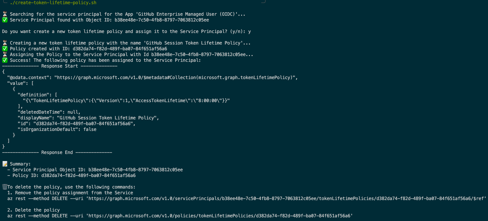

# Set EMU Token Lifetime Policy

**This repository contains a fully-automated, no-inputs required bash script ([create-token-lifetime-policy.sh](./create-token-lifetime-policy.sh)) which automates all the required steps of setting up an Entra Token Lifetime Policy to control the Session Length of a [GitHub EMU (Enterprise Managed Users) Account](https://docs.github.com/en/enterprise-cloud@latest/admin/managing-iam/understanding-iam-for-enterprises/about-enterprise-managed-users) using Entra with OIDC - including [finding the relevant Object-ID for the GitHub Enterprise Managed User (OIDC) App](https://docs.github.com/en/enterprise-cloud@latest/admin/managing-iam/configuring-authentication-for-enterprise-managed-users/finding-the-object-id-for-your-entra-oidc-application), with no inputs required. 🎉**



It was created because the [official documentation for setting the Token Lifetime Policy Assignment](https://learn.microsoft.com/en-us/entra/identity-platform/configure-token-lifetimes#create-a-policy-and-assign-it-to-a-service-principal) only provides formal, non-executable HTTP calls. This can be cumbersome as it requires a lot copy+pasting, making the calls executable (e.g., with CURL) and filling in the required bodies and IDs.

**Prefer manual execution?** Hop to the section [Manual Exection of Steps](#manual-execution-of-steps) further down to learn how to use the Azure CLI to execute the steps manually, if you prefer that.

## Prerequisites

The script uses the [Azure CLI (`az`)](https://learn.microsoft.com/en-us/cli/azure/install-azure-cli) to execute the REST calls.

There are two options:

1. You can just create a [GitHub Codespace](https://docs.github.com/en/codespaces/getting-started/quickstart) from this repository, as it comes with the Azure CLI pre-installed.
2. Alternatively, you will have to install it on your machine.

## Automatic Execution (using the script)

1. Log in to the Azure CLI using `az login --allow-no-subscriptions`. The `--allow-no-subscriptions` flag is important because we are executing commands directly against the Entra Tenant and not working with Azure Subscriptions.

2. Execute the script (you will be prompted for confirmation before any resources is being created):

    ```sh
    ./create-token-lifetime-policy.sh
    ```

That's it! This will set the session lifetime to 8 hours. To set a different session duration, adjust it in the [create-token-lifetime-policy.sh script](./create-token-lifetime-policy.sh).

🗑️ The script will also log the required commands to delete the policy again, in case you want to revert the changes.

## Manual Execution of Steps

Don't trust the script? No problem! You can also perform all these steps manually as follows:

1. Obtain the `ObjectId` of the GitHub OIDC Application from the [Enterprise Cloud Admin Console as described in our documentation](https://docs.github.com/en/enterprise-cloud@latest/admin/managing-iam/configuring-authentication-for-enterprise-managed-users/finding-the-object-id-for-your-entra-oidc-application) or by using the following Azure CLI command:

    ```sh
    az ad sp list --filter "appId eq '12f6db80-0741-4a7e-b9c5-b85d737b3a31'" --query '[].{Name:displayName, ObjectId:id}' --output table
    ```

    You will need this Id in Step 3.

2. Create a new policy with an 8 hour token lifetime.

    ```sh
    TOKEN_BODY='{
      "definition": [
          "{\"TokenLifetimePolicy\":{\"Version\":1,\"AccessTokenLifetime\":\"8:00:00\"}}"
      ],
      "displayName": "GitHub Session Token Lifetime Policy",
      "isOrganizationDefault": false
    }'
    az rest --method POST --uri 'https://graph.microsoft.com/v1.0/policies/tokenLifetimePolicies' --body "$TOKEN_BODY" --headers "Content-Type=application/json"
    ```

    You should receive the following response:

    ```json
    {
      "@odata.context": "https://graph.microsoft.com/v1.0/$metadata#policies/tokenLifetimePolicies/$entity",
      "definition": [
        "{\"TokenLifetimePolicy\":{\"Version\":1,\"AccessTokenLifetime\":\"8:00:00\"}}"
      ],
      "deletedDateTime": null,
      "displayName": "GitHub Session Token Lifetime Policy",
      "id": "abcdef12-3456-7890-abcd-ef1234567890", // The ID will be different for you, of course
      "isOrganizationDefault": false
    }
    ```

3. Assign the policy to the service principal:

    Copy the Policy Id contained in the `id`-field from the response of Step 2. In this example, it is `abcdef12-3456-7890-abcd-ef1234567890`.

    Paste the Service Principal's **Object Id** from Step 1 and the **Policy Id** from Step 2 into the following command and execute it:

    ```sh
    ASSIGN_BODY=$(cat token-policy-assign-body.json)
    az rest --method POST --uri 'https://graph.microsoft.com/v1.0/servicePrincipals/<OBJECT_ID>/tokenLifetimePolicies/$ref' --body "{
      "@odata.id":"https://graph.microsoft.com/v1.0/policies/tokenLifetimePolicies/<POLICY_ID>"
    }" --headers "Content-Type=application/json"
    ```

4. To verify the policy assignment, run the following command to list all policies:

    ```sh
    az rest --method GET --uri 'https://graph.microsoft.com/v1.0/servicePrincipals/12345678-1234-1234-1234-123456789abc/tokenLifetimePolicies'
    ```

### Removing / Deleting the Policy

Using the Service Principal's Object Id or the Policy Id you got from the script above, you can either

1. Remove the token from the service principal,

    ```sh
    az rest --method DELETE --uri 'https://graph.microsoft.com/v1.0/servicePrincipals/${EMU_OIDC_APP_OBJECT_ID}/tokenLifetimePolicies/<POLICY_ID>/$ref'}
    ```

2. or just delete the entire policy

    ```sh
    az rest --method DELETE --uri 'https://graph.microsoft.com/v1.0/policies/tokenLifetimePolicies/<POLICY_ID>'
    ```

If you forgot to note the Id of the policy, you can also list all policies and find the one you want to delete. By default, it goes by the Name `GitHub Session Token Lifetime Policy`.

```sh
az rest --method GET --uri "https://graph.microsoft.com/v1.0/policies/tokenLifetimePolicies"
```
